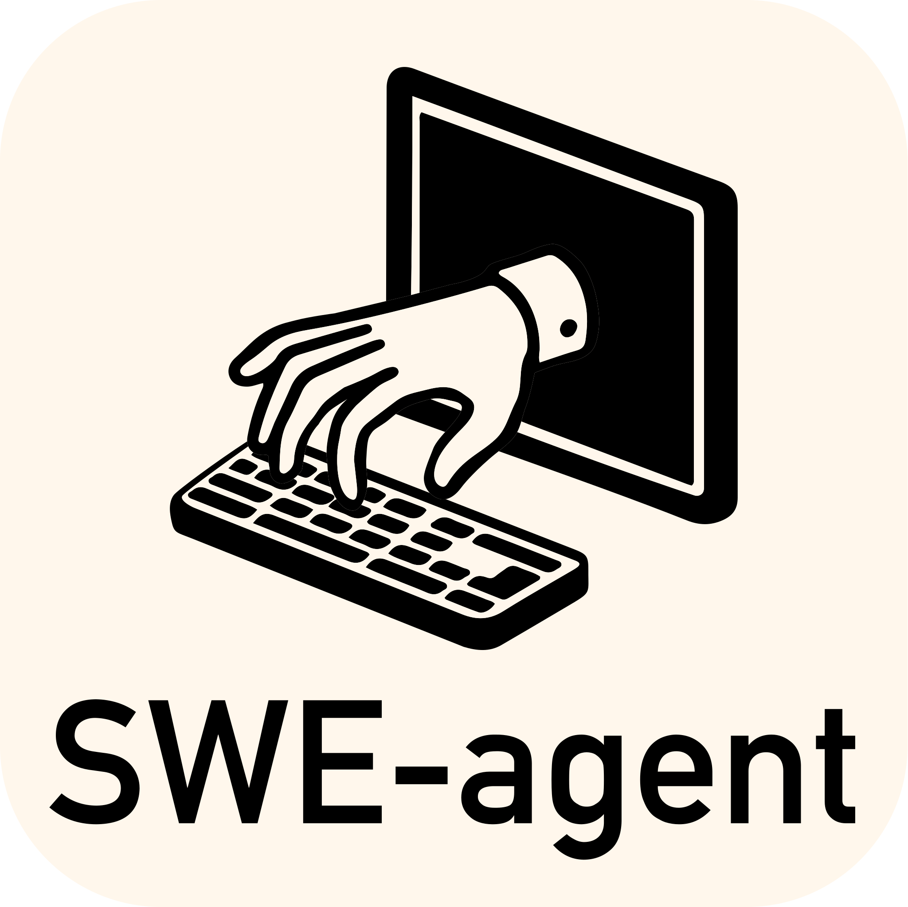

<p align="center">
  <a href="http://swe-bench.github.io">
    
  </a>
</p>

<p align="center"><strong>[&nbsp;<a href="https://swebench.com/SWE-bench/">Read the Docs</a>&nbsp;]</strong></p>

<p align="center">
  <a href="docs/other_languages/README_JP.md">日本語</a> |
  <a href="docs/other_languages/README_CN.md">中文简体</a> |
  <a href="docs/other_languages/README_TW.md">中文繁體</a>
</p>

<p align="center">
    <a href="https://www.python.org/">
        
    </a>
    <a href="https://copyright.princeton.edu/policy">
        
    </a>
    <a href="https://badge.fury.io/py/swebench">
        
    </a>
</p>

---

# SWE-bench-Plus: Test Enhancer

SWE-bench-Plus is a coverage-guided test generation and evaluation layer built on top of the official SWE-bench harness. It automates iterative LLM-based test generation, avoids duplicates, targets uncovered code paths, and stops when coverage plateaus. It is designed for high-throughput, resume-friendly batch runs with robust logging and fault tolerance.

## Key Features

- __Coverage-guided generation__: After each iteration, the harness measures coverage and selects uncovered paths to guide the next prompt. Stops early when coverage plateaus.
- __Targeted prompts__: The prompt includes a “Methods Under Test” section that embeds source ranges for uncovered paths so the LLM can focus on missing lines/branches.
- __Early stopping__: Configurable patience; we stop generating when coverage stops improving or when a max accepted test count is reached.
- __Deduplication__: Drops newly generated tests that duplicate previously accepted tests (by function/class definitions).
- __Robust LLM invocation__: Retries with exponential backoff; schema repair if YAML is malformed; syntax validation of codeblocks before acceptance.
- __Per-instance resume__: Instances with an existing `metrics.json` are skipped (cached). If `accepted_total == 0`, the instance is reattempted in the same run. Patch-apply failures write metrics and are also skipped on subsequent runs.
- __Container reuse__: Reuses an existing Docker container for the same `run_id`/instance when available to avoid unnecessary rebuilds (configurable).
- __HF offline mode__: Uses local cached datasets only to avoid network flakiness and 429s.
- __Windows-friendly__: Longer Docker timeouts, backoff, and CRLF-safe patch/test scripts.

## Install

1) Install Docker and ensure it’s running.
2) Install Python 3.10+ and pip.
3) Install SWE-bench-Plus in editable mode:

```bash
pip install -e .
```

## Quick Start (Batch)

Generate tests across many instances with robust logging and resume:

```bash
python -m swebench.test_enhancer.batch_generate \
  --run_id TE_batch_20 \
  --dataset_name SWE-bench/SWE-bench \
  --split test \
  --predictions_path model_generated/20241103_OpenHands-CodeAct-2.1-sonnet-20241022.filtered.jsonl \
  --model gpt-5-mini \
  --timeout 60 \
  --max_workers 12
```

Notes:
- Instances with a cached `metrics.json` for the same `run_id` are skipped.
- If an instance’s previous metrics has `accepted_total == 0`, it is reattempted.
- If a test patch cannot be applied, we write `reason.txt` and a metrics flag; the instance is skipped in subsequent runs.

## Coverage-Guided Generation

- Baseline coverage (upstream tests only) is recorded before iterations: `baseline/coverage_baseline.json`.
- After each iteration, we run upstream + LLM tests and record combined coverage per iteration: `iter/<n>/combined/coverage_combined.json`.
- We compute covered lines for the source file under test; if coverage doesn’t improve for N iterations (patience), we stop.
- Prompts include uncovered path snippets to bias the LLM toward missing code.

## Important Environment Variables

- __LLM and batch robustness__
  - `TE_LLM_MAX_RETRIES` (default 5)
  - `TE_LLM_BACKOFF_BASE` (default 2)
  - `TE_LLM_REQUEST_TIMEOUT` (seconds, default 45)
  - `TE_INSTANCE_RETRIES` (re-run instance on `llm_no_response`, default 2)
  - `TE_QUIET` (suppress noisy logs; default 1 in batch)

- __Coverage-guided generation__
  - `TE_ENABLE_COVERAGE_GUIDE` (default 1)
  - `TE_COVERAGE_PATIENCE` (default 2)
  - `TE_MAX_ACCEPTED` (stop after this many accepted tests; default 300)
  - `TE_ONLY_LLM` (run only LLM module vs. upstream + LLM; default 1 for speed in batch)

- __Container and Docker__
  - `TE_REUSE_CONTAINER` (reuse container if exists; default 1)
  - `TE_BUILD_MAX_RETRIES` (default 2), `TE_BUILD_BACKOFF_BASE` (seconds, default 15)
  - `DOCKER_CLIENT_TIMEOUT` (default 600), `COMPOSE_HTTP_TIMEOUT` (default 600)

- __Hugging Face/Datasets__
  - `HF_DATASETS_OFFLINE=1`, `HF_HUB_OFFLINE=1` (force local cache)
  - Set automatically in batch; loader also uses `DownloadConfig(local_files_only=True)`.

## Logs and Artifacts

Per-instance directory: `logs/test_enhancer/<run_id>/<instance_id>/`

- `run_instance.log` — full log for the instance
- `metrics.json` — counts and status, including `accepted_total`
- `accepted_tests.py` — cumulative accepted tests
- `patch.normalized.diff` / `patch.minimal.diff` — sanitized diffs used for patching
- Iteration subfolders: `iter/0`, `iter/1`, ... each with raw LLM outputs and coverage
- Baseline coverage: `baseline/coverage_baseline.json`

## Troubleshooting

- __Patch apply failed__
  - We sanitize patch text (CRLF→LF, strip BOM, drop diagnostics and `\ No newline at end of file`). If apply still fails, we write `reason.txt` and mark `skipped_patch_apply_failure` in `metrics.json` so it’s skipped later.

- __HTTP 429s (Hugging Face)__
  - Batch sets offline mode; loader enforces `local_files_only=True`. Use a warmed local cache to avoid network calls.

- __Windows Docker named pipe timeouts__
  - We use longer Docker client/API timeouts and build retries; you can lower `--max_workers` to reduce pressure.

## Example: Single Instance (Debug)

To focus on a single instance, run the batch with `--instance_ids` or create a tiny predictions file containing just that instance.

```bash
python -m swebench.test_enhancer.batch_generate \
  --run_id TE_debug \
  --dataset_name SWE-bench/SWE-bench \
  --split test \
  --predictions_path gold \
  --model gpt-5-mini \
  --timeout 60 \
  --max_workers 1 \
  --instance_ids django__django-13670
```

The run will generate targeted tests that fail under the model patch, pass under the gold patch, and survive flakiness filters. Accepted tests are written to `accepted_tests.py`.

---

Code and data for the following works:
* [ICLR 2025] <a href="https://arxiv.org/abs/2410.03859">SWE-bench Multimodal: Do AI Systems Generalize to Visual Software Domains?</a>
* [ICLR 2024 Oral] <a href="https://arxiv.org/abs/2310.06770">SWE-bench: Can Language Models Resolve Real-World GitHub Issues?</a>

## 📰 News
* **[Jan. 13, 2025]**: We've integrated [SWE-bench Multimodal](https://swebench.github.io/multimodal) ([paper](https://arxiv.org/abs/2410.03859), [dataset](https://huggingface.co/datasets/SWE-bench/SWE-bench_Multimodal)) into this repository! Unlike SWE-bench, we've kept evaluation for the test split *private*. Submit to the leaderboard using [sb-cli](https://github.com/swe-bench/sb-cli/tree/main), our new cloud-based evaluation tool.
* **[Jan. 11, 2025]**: Thanks to [Modal](https://modal.com/), you can now run evaluations entirely on the cloud! See [here](https://github.com/swe-bench/SWE-bench/blob/main/docs/assets/evaluation.md#%EF%B8%8F-evaluation-with-modal) for more details.
* **[Aug. 13, 2024]**: Introducing *SWE-bench Verified*! Part 2 of our collaboration with [OpenAI Preparedness](https://openai.com/preparedness/). A subset of 500 problems that real software engineers have confirmed are solvable. Check out more in the [report](https://openai.com/index/introducing-swe-bench-verified/)!
* **[Jun. 27, 2024]**: We have an exciting update for SWE-bench - with support from [OpenAI's Preparedness](https://openai.com/preparedness/) team: We're moving to a fully containerized evaluation harness using Docker for more reproducible evaluations! Read more in our [report](https://github.com/swe-bench/SWE-bench/blob/main/docs/20240627_docker/README.md).
* **[Apr. 2, 2024]**: We have released [SWE-agent](https://github.com/SWE-agent/SWE-agent), which sets the state-of-the-art on the full SWE-bench test set! ([Tweet 🔗](https://twitter.com/jyangballin/status/1775114444370051582))
* **[Jan. 16, 2024]**: SWE-bench has been accepted to ICLR 2024 as an oral presentation! ([OpenReview 🔗](https://openreview.net/forum?id=VTF8yNQM66))

## 👋 Overview
SWE-bench is a benchmark for evaluating large language models on real world software issues collected from GitHub.
Given a *codebase* and an *issue*, a language model is tasked with generating a *patch* that resolves the described problem.


To access SWE-bench, copy and run the following code:
```python
from datasets import load_dataset
swebench = load_dataset('princeton-nlp/SWE-bench', split='test')
```

## 🚀 Set Up
SWE-bench uses Docker for reproducible evaluations.
Follow the instructions in the [Docker setup guide](https://docs.docker.com/engine/install/) to install Docker on your machine.
If you're setting up on Linux, we recommend seeing the [post-installation steps](https://docs.docker.com/engine/install/linux-postinstall/) as well.

Finally, to build SWE-bench from source, follow these steps:
```bash
git clone git@github.com:princeton-nlp/SWE-bench.git
cd SWE-bench
pip install -e .
```

Test your installation by running:
```bash
python -m swebench.harness.run_evaluation \
    --predictions_path gold \
    --max_workers 1 \
    --instance_ids sympy__sympy-20590 \
    --run_id validate-gold
```
> [!NOTE]
> If using a MacOS M-series or other ARM-based systems, add `--namespace ''` to the above script.
> By default, the evaluation script pulls images (built for Linux) from [DockerHub](https://hub.docker.com/u/swebench).
> Adding `--namespace ''` will cause evaluation images to be built locally instead.

## 💽 Usage
Evaluate patch predictions on SWE-bench Lite with the following command:
```bash
python -m swebench.harness.run_evaluation \
    --dataset_name princeton-nlp/SWE-bench_Lite \
    --predictions_path <path_to_predictions> \
    --max_workers <num_workers> \
    --run_id <run_id>
    # use --predictions_path 'gold' to verify the gold patches
    # use --run_id to name the evaluation run
    # use --modal true to run on Modal
```

This command will generate docker build logs (`logs/build_images`) and evaluation logs (`logs/run_evaluation`) in the current directory.

The final evaluation results will be stored in the `evaluation_results` directory.

> [!WARNING]
> SWE-bench evaluation can be resource intensive
> We recommend running on an `x86_64` machine with at least 120GB of free storage, 16GB of RAM, and 8 CPU cores.
> We recommend using fewer than `min(0.75 * os.cpu_count(), 24)` for `--max_workers`.
>
> If running with Docker desktop, make sure to increase your virtual disk space to ~120 free GB. Set max_workers to be consistent with the above for the CPUs available to Docker.
>
> Support for `arm64` machines is experimental.

To see the full list of arguments for the evaluation harness, run:
```bash
python -m swebench.harness.run_evaluation --help
```

See the [evaluation tutorial](docs/guides/evaluation.md) for the full rundown on datasets you can evaluate.
If you're looking for non-local, cloud based evaluations, check out...
* [sb-cli](https://github.com/swe-bench/sb-cli), our tool for running evaluations automatically on AWS, or...
* Running SWE-bench evaluation on [Modal](https://modal.com/). Details [here](docs/guides/evaluation.md#Cloud-Based-Evaluation)

Additionally, you can also:
* [Train](https://github.com/swe-bench/SWE-bench/tree/main/swebench/inference/make_datasets) your own models on our pre-processed datasets. (🆕 Check out [SWE-smith](https://swesmith.com/), a dedicated toolkit for creating SWE training data.)
* Run [inference](docs/reference/inference.md) on existing models (both local and API models). The inference step is where you give the model a repo + issue and have it generate a fix.
*  Run SWE-bench's [data collection procedure](https://github.com/swe-bench/SWE-bench/blob/main/swebench/collect/) ([tutorial](docs/guides/collection.md)) on your own repositories, to make new SWE-Bench tasks.
    * ⚠️ We are temporarily pausing support for queries around creating SWE-bench instances. Please see the note in the tutorial.

## ⬇️ Downloads
| Datasets | Models | RAG |
| - | - | - |
| [💿 SWE-bench](https://huggingface.co/datasets/SWE-bench/SWE-bench) | [🦙 SWE-Llama 13b](https://huggingface.co/princeton-nlp/SWE-Llama-13b) | [🤗 "Oracle" Retrieval](https://huggingface.co/datasets/SWE-bench/SWE-bench_oracle) |
| [💿 SWE-bench Lite](https://huggingface.co/datasets/SWE-bench/SWE-bench_Lite) | [🦙 SWE-Llama 13b (PEFT)](https://huggingface.co/princeton-nlp/SWE-Llama-13b-peft) | [🤗 BM25 Retrieval 13K](https://huggingface.co/datasets/SWE-bench/SWE-bench_bm25_13K) |
| [💿 SWE-bench Verified](https://huggingface.co/datasets/SWE-bench/SWE-bench_Verified) | [🦙 SWE-Llama 7b](https://huggingface.co/princeton-nlp/SWE-Llama-7b) | [🤗 BM25 Retrieval 27K](https://huggingface.co/datasets/SWE-bench/SWE-bench_bm25_27K) |
| [💿 SWE-bench Multimodal](https://huggingface.co/datasets/SWE-bench/SWE-bench_Multimodal) | [🦙 SWE-Llama 7b (PEFT)](https://huggingface.co/princeton-nlp/SWE-Llama-7b-peft) | [🤗 BM25 Retrieval 40K](https://huggingface.co/datasets/SWE-bench/SWE-bench_bm25_40K) |
| | | [🤗 BM25 Retrieval 50K (Llama tokens)](https://huggingface.co/datasets/SWE-bench/SWE-bench_bm25_50k_llama) |

## 💫 Contributions
We would love to hear from the broader NLP, Machine Learning, and Software Engineering research communities, and we welcome any contributions, pull requests, or issues!
To do so, please either file a new pull request or issue and fill in the corresponding templates accordingly. We'll be sure to follow up shortly!

Contact person: [Carlos E. Jimenez](http://www.carlosejimenez.com/) and [John Yang](https://john-b-yang.github.io/) (Email: carlosej@princeton.edu, johnby@stanford.edu).

## ✍️ Citation & license
MIT license. Check `LICENSE.md`.

If you find our work helpful, please use the following citations.

```bibtex
@inproceedings{
    jimenez2024swebench,
    title={{SWE}-bench: Can Language Models Resolve Real-world Github Issues?},
    author={Carlos E Jimenez and John Yang and Alexander Wettig and Shunyu Yao and Kexin Pei and Ofir Press and Karthik R Narasimhan},
    booktitle={The Twelfth International Conference on Learning Representations},
    year={2024},
    url={https://openreview.net/forum?id=VTF8yNQM66}
}

@inproceedings{
    yang2024swebenchmultimodal,
    title={{SWE}-bench Multimodal: Do AI Systems Generalize to Visual Software Domains?},
    author={John Yang and Carlos E. Jimenez and Alex L. Zhang and Kilian Lieret and Joyce Yang and Xindi Wu and Ori Press and Niklas Muennighoff and Gabriel Synnaeve and Karthik R. Narasimhan and Diyi Yang and Sida I. Wang and Ofir Press},
    booktitle={The Thirteenth International Conference on Learning Representations},
    year={2025},
    url={https://openreview.net/forum?id=riTiq3i21b}
}
```

## Our Other Projects

<div align="center">
  <a href="https://github.com/SWE-bench/sb-cli"></a>
   &nbsp;&nbsp;
  <a href="https://github.com/SWE-bench/SWE-smith"></a>
   &nbsp;&nbsp;
  <a href="https://github.com/SWE-agent/SWE-agent"></a>
   &nbsp;&nbsp;
  <a href="https://github.com/SWE-agent/SWE-ReX"></a>
   &nbsp;&nbsp;
  <!-- <a href="https://github.com/SWE-bench/SWE-bench"></a> -->
</div>
